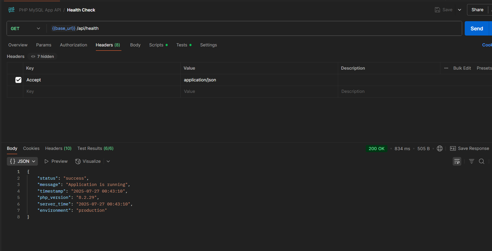
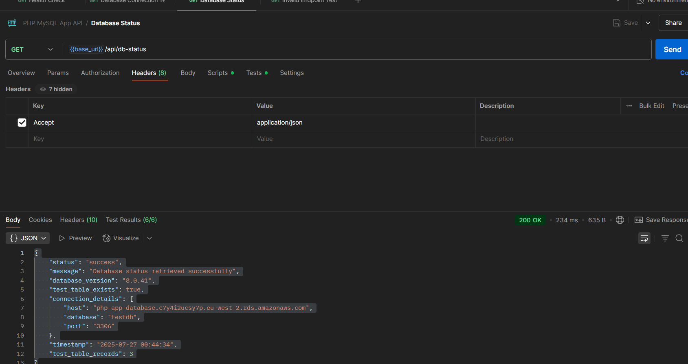
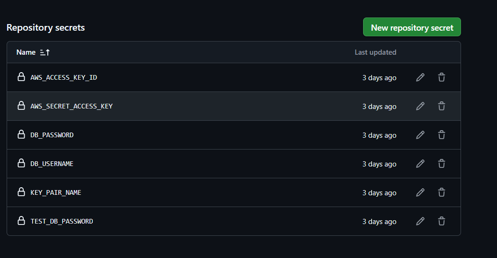
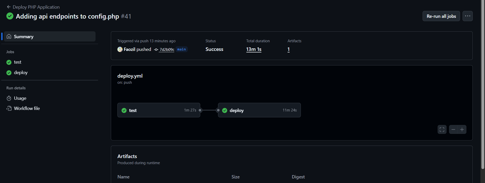
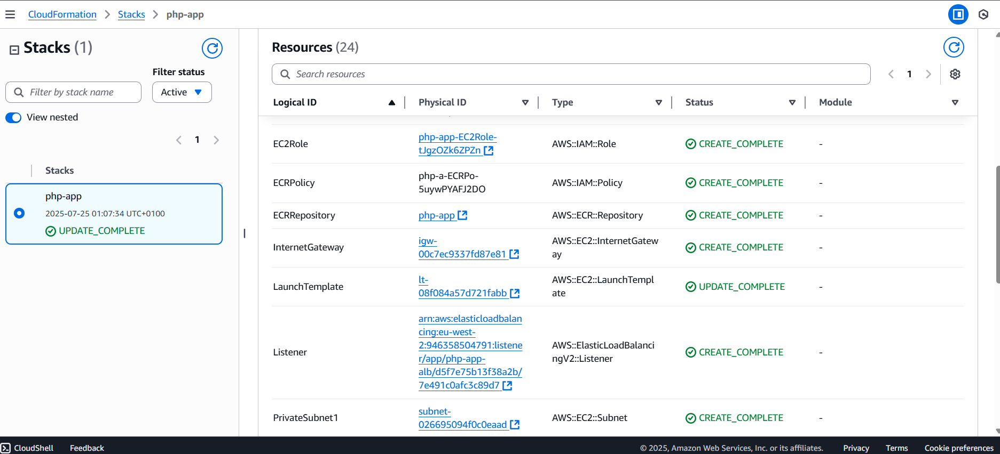
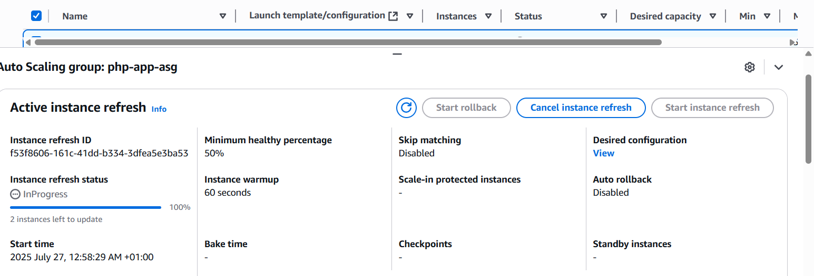
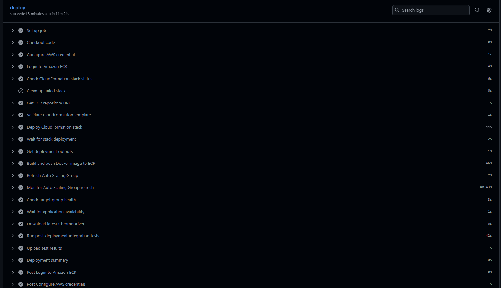
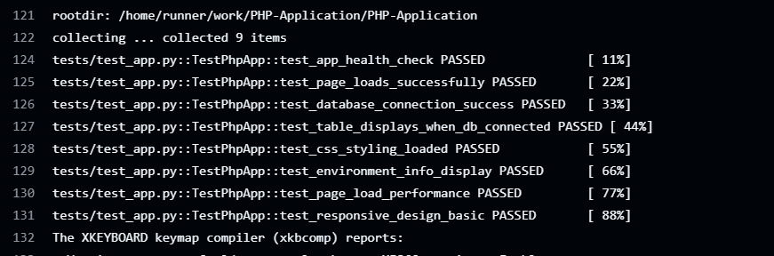

# Simple PHP Application

A simple PHP web application with MySQL database integration, containerized deployment, and CI/CD pipeline using GitHub Actions, AWS CloudFormation, and Docker.

## Features

- **PHP 8.0+ Application** with MySQL database connectivity
- **Docker Containerization** for consistent deployment
- **AWS Cloud Infrastructure** using CloudFormation
- **CI/CD Pipeline** with GitHub Actions
- **Automated Testing** with Selenium and pytest
- **API Endpoints** for health checks and database testing
- **Load Balancing** with Application Load Balancer
- **Auto Scaling** with EC2 Auto Scaling Groups
- **Database Management** with RDS MySQL
- **Container Registry** with Amazon ECR
- **Monitoring & Logging** with CloudWatch and grafana


## Table of Contents

- [Architecture Overview](#architecture-overview)
- [Prerequisites](#prerequisites)
- [API Endpoints](#api-endpoints)
- [Deployment](#deployment)
- [Infrastructure](#infrastructure)
- [CI/CD Pipeline](#cicd-pipeline)
- [Testing](#testing)
- [Monitoring](#monitoring)

## Architecture Overview

The application follows a modern cloud-native architecture:

- **Frontend**: Simple PHP web interface
- **Backend**: PHP application with PDO MySQL connectivity
- **Database**: Amazon RDS MySQL 8.0
- **Infrastructure**: AWS with VPC, Load Balancer, Auto Scaling
- **Container Registry**: Amazon ECR
- **Deployment**: Blue-green deployment via Auto Scaling Group refresh

## Prerequisites

### AWS Deployment
- AWS CLI configured
- AWS Account with appropriate permissions
- EC2 Key Pair for SSH access
- GitHub repository with Actions enabled

### Required AWS Permissions
```json
{
  "Version": "2012-10-17",
  "Statement": [
    {
      "Effect": "Allow",
      "Action": [
        "cloudformation:*",
        "ec2:*",
        "rds:*",
        "elasticloadbalancing:*",
        "autoscaling:*",
        "ecr:*",
        "iam:*",
        "logs:*"
      ],
      "Resource": "*"
    }
  ]
}
```
## API Endpoints

The application provides RESTful API endpoints for monitoring and testing:

Testing with Postman:

- Import the Postman collection [PHP-MySQL-App-API.postman_collection.json]
- Run the collection to test all endpoints
- Each request includes automated tests for validation

### Health Check
**GET** `/api/health`

```json
{
  "status": "success",
  "message": "Application is running",
  "timestamp": "2025-07-26 22:30:00",
  "php_version": "8.2.0",
  "server_time": "2025-07-26 22:30:00",
  "environment": "production"
}
```

### Database Connection Test
**GET** `/api/db-test`

```json
{
  "status": "success",
  "message": "Database connection successful",
  "database_time": "2025-07-26 22:30:00",
  "connection_test": "passed",
  "host": "mysql-host",
  "database": "testdb",
  "timestamp": "2025-07-26 22:30:00"
}
```

### Database Status
**GET** `/api/db-status`

```json
{
  "status": "success",
  "message": "Database status retrieved successfully",
  "database_version": "8.0",
  "test_table_exists": true,
  "test_table_records": 3,
  "connection_details": {
    "host": "mysql-host",
    "database": "testdb",
    "port": "3306"
  },
  "timestamp": "2025-07-26 22:30:00"
}
```




## Deployment

### GitHub Secrets Configuration

Configure the following secrets in your GitHub repository:

```bash
# AWS Credentials
AWS_ACCESS_KEY_ID=your_access_key
AWS_SECRET_ACCESS_KEY=your_secret_key

# Database Configuration
DB_USERNAME=admin
DB_PASSWORD=your_secure_password
TEST_DB_PASSWORD=test_password

# EC2 Configuration
KEY_PAIR_NAME=your_key_pair_name
```



### Deployment Process

1. **Push to Main Branch**
   ```bash
   git add .
   git commit -m "Deploy application"
   git push origin main
   ```

2. **Monitor GitHub Actions**
   - Navigate to Actions tab in GitHub repository
   - Monitor the deployment workflow progress



3. **Verify Deployment**
   - Check CloudFormation stack creation
   - Verify application accessibility via Load Balancer DNS

## 🏛️ Infrastructure

### AWS Resources Created

| Resource | Type | Purpose |
|----------|------|---------|
| VPC | AWS::EC2::VPC | Network isolation |
| Subnets | AWS::EC2::Subnet | Public/Private network segments |
| Internet Gateway | AWS::EC2::InternetGateway | Internet access |
| Security Groups | AWS::EC2::SecurityGroup | Network security rules |
| RDS Instance | AWS::RDS::DBInstance | MySQL database |
| Application Load Balancer | AWS::ElasticLoadBalancingV2::LoadBalancer | Traffic distribution |
| Auto Scaling Group | AWS::AutoScaling::AutoScalingGroup | High availability |
| ECR Repository | AWS::ECR::Repository | Container image storage |
| IAM Roles | AWS::IAM::Role | Service permissions |



## 🔄 CI/CD Pipeline

### Pipeline Stages

1. **Test Stage**
   - Docker image build and caching
   - MySQL container setup
   - Database connectivity testing
   - Selenium web testing
   - Performance validation

2. **Deploy Stage**
   - AWS credentials configuration
   - CloudFormation template validation
   - Infrastructure provisioning/update
   - Docker image push to ECR
   - Auto Scaling Group refresh

   - Health check validation



### Pipeline Configuration

The pipeline is defined in `.github/workflows/deploy.yaml` with the following key features:

- **Parallel Testing**: Multiple test types run concurrently
- **Environment Isolation**: Separate test and production environments
- **Health Monitoring**: Continuous health checks during deployment

## Testing

### Test Suite Structure

```
tests/
├── conftest.py          # Test configuration and fixtures
├── test_php_app.py      # Main application tests
├── requirements.txt     # Python test dependencies
```

### Test Coverage

- ✅ Application health check
- ✅ Page load functionality
- ✅ Database connectivity
- ✅ Table display when DB connected
- ✅ CSS styling validation
- ✅ Environment information display
- ✅ Page load performance
- ✅ Responsive design basics
- ✅ Status message styling



## Monitoring

### Grafana Dashboard

The application includes a pre-configured Grafana dashboard for monitoring:

- **EC2 CPU Utilization** (Auto Scaling Group)
- **Load Balancer Request Count**
- **RDS CPU Utilization**
- **Application Response Times**
- **Error Rates**


### CloudWatch Metrics

Key metrics monitored:
- EC2 instance health
- Database performance
- Application load balancer statistics
- Auto scaling events
- Application logs

### Log Analysis

Application logs are centralized in CloudWatch with structured logging:

```bash
# View application logs
aws logs tail /aws/ec2/php-app --follow

# View deployment logs
aws logs tail /aws/codebuild/php-app-build --follow
```
<!-- Thank you -->
